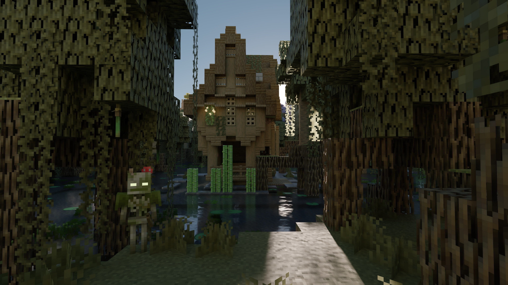

# Caustica RTX

Caustica RTX is an experimental, RTX-focused fork of
[ComfyFluffy/Caustica](https://github.com/ComfyFluffy/Caustica) for Minecraft 26.2's Vulkan backend.
It replaces the vanilla world view with hardware ray tracing and NVIDIA DLSS
features while keeping Minecraft's familiar UI and gameplay intact.

Caustica is early software. Expect bugs, missing visual cases, and frequent
changes while the renderer is being built.

## Links

- [Discord](https://discord.gg/SeWCjyKu2)
- [Modrinth](https://modrinth.com/mod/caustica)
- [CurseForge](https://www.curseforge.com/minecraft/mc-mods/caustica/preview)
- [Gallery](docs/gallery.md)

## Features

- Vulkan hardware path-traced world rendering
- DLSS Ray Reconstruction support
- DLSS Frame Generation and RTX 50 Multi Frame Generation up to 4x (experimental)
- NVIDIA Reflex with Low Latency Boost
- Capability-gated DLSS Neural Rendering / 3D-Guided Neural Rendering integration
- RTX-safe Caustica-native post effects (contrast, saturation, vignette, optional sharpen)
- RTX Performance Mode for lower path-tracing cost before Frame Generation
- In-game DLSS, frame-generation, multiplier, Reflex, and menu-suspension controls
- PsychoV24 and analytical SDR tone mapping
- Shuffled-scrambled Sobol path and RIS sampling
- Correct alpha-tested redstone rendering
- HDR output
- Dynamic entity rendering in the ray-traced scene
- LabPBR-style material support
- OMM (Opacity Micro-Map) + SER (Shader Execution Reordering) optimizations

## Requirements

- **Vulkan graphics backend enabled**
- Minecraft `26.2`, Fabric Loader `0.19.3` or newer, Fabric API, and Java 25
- A GPU and driver with Vulkan ray tracing support
- NVIDIA RTX GPU and supported driver for DLSS features
- HDR-capable display and OS HDR mode for HDR output
- On Linux, an HDR-capable Wayland compositor and a native Wayland session for HDR output
- Install LabPBR resource pack like [SPBR](https://modrinth.com/resourcepack/spbr) for better visuals

## Installation

1. Install Fabric Loader for Minecraft `26.2`.
2. Install Fabric API.
3. Put the Caustica jar in your Minecraft `mods` folder.
4. Launch the game with the Vulkan graphics backend.
5. Open Video Settings to adjust Caustica RTX's renderer options.

## Usage Notes

- Caustica is client-side only.
- DLSS Ray Reconstruction and Frame Generation require supported NVIDIA
  hardware and drivers.
- On Linux if Minecraft crashes on startup with stack overflow errors, try adding `-Xss2M` to the Java args to increase the stack size.
- Use Java args to improve performance. Minecraft Launcher default:
  `-XX:+UseCompactObjectHeaders -XX:+AlwaysPreTouch -XX:+UseStringDeduplication -XX:+UseZGC`
- Frame Generation, its 2x-4x multiplier, Reflex, and Reflex Boost are available in Video Settings.
- DLSS Neural Rendering settings are exposed in Video Settings, but activation requires a compatible NVIDIA-authorized DLSS-NR/NGX SDK/runtime. Public builds without that SDK report the feature unavailable instead of enabling a fake toggle.
- Caustica Post FX provides shader-like visual controls without installing Iris/Sodium or replacing Caustica's Vulkan renderer.
- RTX Performance Mode applies 1 SPP, 2 bounces, 4 RIS candidates, disables ray-traced particles/water waves, and keeps sharpen at zero to improve the real rendered base FPS before MFG.
- 3x and 4x Multi Frame Generation require a supported GeForce RTX 50 Series GPU and driver.
- HDR output requires an HDR swapchain and a correctly configured HDR display.
- When HDR is enabled on Linux, Caustica selects GLFW's native Wayland backend automatically. X11/XWayland surfaces generally do not expose the required HDR10/PQ format.
- If Minecraft falls back to OpenGL after a crash, re-enable the Vulkan backend
  before using Caustica again.

## Compatibility

Caustica takes over the world renderer, so other mods that heavily modify world
rendering, shader pipelines, post-processing, or the Vulkan backend may conflict.
Iris/Sodium shader-pipeline mode is therefore not combined with Caustica RTX.
Use LabPBR resource packs plus Caustica's native post effects for RTX-safe visual
customization. UI-only and non-renderer performance mods are more likely to work.

## Status

Caustica is not a finished renderer yet. Current work focuses on visual
correctness, world coverage, stability, and making the SDR/HDR presentation
paths behave consistently.

## License

Caustica's project-owned source code and documentation are licensed under the
GNU Lesser General Public License v3.0 or later. See [LICENSE.md](LICENSE.md),
[COPYING](COPYING), and [COPYING.LESSER](COPYING.LESSER).

Release artifacts may bundle NVIDIA DLSS/NGX SDK components under NVIDIA's own
license terms. See [THIRD_PARTY_NOTICES.md](THIRD_PARTY_NOTICES.md).

## TODO List

- [ ] Nether/End sky, weather, volumetric fog/clouds
- [ ] NRD + FSR for non-NVIDIA GPUs
- [ ] LOD
- [ ] ReSTIR

## DLSS Neural Rendering build support

The normal public CI uses NVIDIA's public DLSS SDK. If that SDK does not contain
`nvsdk_ngx_helpers_dlssnr_vk.h`, CMake builds the DLSS-NR ABI as safe stubs and the
game reports Neural Rendering as unavailable while RR, FG/MFG and Reflex remain fully usable.

A build environment with an NVIDIA-authorized compatible DLSS-NR SDK can enable the
native implementation automatically when the feature-specific header is present.
No proprietary NVIDIA SDK/runtime files are committed to this repository.

## ScandiShader Caustica-native port

The optional **ScandiShader RTX Look** is the Caustica-native port of the compatible visual parts of the user-supplied ScandiCraft shaderpack. It is not an Iris/OptiFine compatibility wrapper: Caustica remains the Vulkan/path-traced renderer and the original Iris shader ZIP must stay disabled while Caustica is active.

Converted components:
- exact single-pixel DERCODE Fast Grade logic from the supplied ScandiShader derivative
- exact `scandicraft_dercode_balanced` grade values: saturation 1.06, contrast 1.04,
  grade strength 0.65, cool-shadow tint 0.40, warm-highlight tint 0.30
- existing Caustica bloom, path-traced reflections/refraction, animated water and physical sky
  remain the rendering source, avoiding duplicate raster/screen-space lighting passes

Not yet reproduced pixel-for-pixel:
- the supplied shaderpack's dedicated volumetric-light/fog implementation and cloud renderer.
  Reproducing those would require native Caustica volumetric passes rather than loading Iris GLSL.

Not imported because Caustica already replaces them:
- shadow maps
- SSAO/GTAO
- SSR
- raster GI/RSM
- TAA/FXAA/FSR upscaling
- Iris volumetric cloud/fog renderer passes

This keeps the supplied shader's presentation while preserving Caustica path tracing, DLSS Ray Reconstruction, Neural Rendering integration, Frame Generation/MFG and Reflex. Use the Caustica-adapted ScandiTexture resource pack for textures/celestials; do not stack the legacy Iris shader pipeline on top of Caustica.

**RTX Performance Mode is reversible:** enabling it snapshots the current SPP/bounce/RIS/particles/glow/waves/sharpen settings, applies the low-cost preset, and restores the previous values when disabled in the same session.

### Credits

The supplied shaderpack identifies **MakeUp Ultra Fast 9.3h** by Javier Garduño as its base
and explicitly permits modification/forking with credit. Its ScandiCraft derivative also
credits **DERCODE Project / Mizore** for the visual-grade inspiration. This repository ports
only the compatible visual-grade behavior and does not redistribute the original Iris shaderpack.
