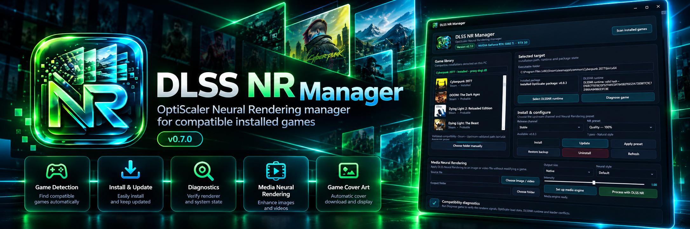

<p align="center">
  
</p>

# DLSS NR Manager

<p align="center">
  
</p>

A native Windows manager for installing, diagnosing and maintaining the experimental **OptiScaler DLSS Neural Rendering (DLSSNR)** stack, with PC update, cleanup, media AI and Minecraft RTX utilities.

Current application version: **v1.0.0**.

> Supports automatic candidate detection across **Steam, Epic, GOG, itch.io, Ubisoft Connect, EA App, Xbox App and Battle.net**, NVIDIA RTX 20/30/40/50 GPUs, official NVIDIA Streamline runtime provisioning, PC software/driver update checks and safe Windows/NVIDIA cache cleanup.

## Screenshots

<p align="center">
  
</p>

<p align="center"><sub>Application capture on Windows — full-resolution PNG, not a generated UI mockup.</sub></p>

## Features

### Game detection and DLSS Neural Rendering

- WPF / .NET 8, Windows x64
- Self-contained single-file executable
- Installed-game scanning through Steam, Epic, GOG, itch.io, Ubisoft Connect, EA App, Xbox App and Battle.net
- Compatibility confidence: Validated / Probable / Candidate
- Manual game-folder selection fallback
- NVIDIA GPU and RTX-generation detection
- Stable/prerelease selection from the upstream OptiScaler-DLSSNR fork
- Full managed-install backup before game-directory changes
- Install, update, restore and uninstall flows
- Proxy conflict detection; unknown proxy DLLs are never silently overwritten
- Integrated `OptiScaler.log` viewer and per-game compatibility diagnostics
- Neural Rendering presets plus advanced OptiScaler overlay/process settings
- Game cover artwork with Steam and multi-provider fallback resolution
- Dedicated Battlefield 6 / BF6 artwork handling
- Local artwork cache with **Clear cover cache**
- Multi-resolution Windows application icon generated before compilation

### Automatic NVIDIA runtime/resources

- Optional automatic download of the latest official **NVIDIA-RTX/Streamline** GitHub release
- Extracts `nvngx_dlssnr.dll` from the official package when no local runtime is selected
- Validates x64 architecture and NVIDIA Authenticode publisher before use
- Existing known SHA-256 runtime fingerprints remain accepted
- Can add missing Streamline/DLSS runtime resources to the selected game:
  - `sl.interposer.dll`
  - `sl.common.dll`
  - `sl.dlss.dll` / `nvngx_dlss.dll`
  - `sl.dlss_d.dll` / `nvngx_dlssd.dll` for DLSS Ray Reconstruction when supported by the renderer
  - `sl.dlss_g.dll` / `nvngx_dlssg.dll`
  - `sl.reflex.dll` plus `NvLowLatencyVk.dll` when present for the Vulkan Reflex path
  - `sl.dlss_nr.dll` / `nvngx_dlssnr.dll` when present in the selected Streamline package
- Existing vendor DLLs in a game are not overwritten by the resource-completion step
- NVIDIA binaries are **not committed to this repository**

Validated compatibility hashes currently retained by the manager:

- RTX 50 DLSSNR SHA-256: `E16BCF15E16E13F527491CDF7845B2FE6521A738D8F7C9C721866A8496E1FC8E`
- RTX 20/30/40 compatibility runtime SHA-256: `E67DEE209320CDAFE0E93E45675D7AA34323A53ACC57A72B2E40A181581C989A`

### PC Update Center

- Scans installed software for available updates using WinGet
- Merges `winget upgrade` and `winget list --upgrade-available` results
- Optional Chocolatey `outdated` detection when Chocolatey is installed
- Scans Windows Update for Windows, driver and firmware updates
- Reads connected-device driver metadata when Windows Update exposes it
- Detects NVIDIA GPU/driver version through `nvidia-smi` when available
- Reports whether Windows Update currently offers a newer NVIDIA display driver
- Links to the official NVIDIA driver page for the definitive Game Ready / Studio check
- **WinGet update all** button with explicit confirmation before running `winget upgrade --all`
- WinGet action never installs BIOS/firmware or Windows Update items
- UTF-8-safe PowerShell/Windows Update parsing for localized Windows installations

### PC Cleanup

Safe, explicit cache analysis and cleanup inspired by system-cleaner workflows:

- Current-user temporary files
- Windows Temp
- DirectX shader cache
- NVIDIA DXCache
- NVIDIA GLCache
- NVIDIA legacy `NV_Cache`
- Per-category selection
- Analyze total reclaimable size before deletion
- Locked/in-use and inaccessible files are skipped
- Cache directories are preserved; only contents are cleaned
- Re-analysis after cleanup shows remaining cache size

The cleaner intentionally does **not** touch browser profiles, documents, downloads, registry entries, restore points, Recycle Bin data or Windows Update storage.

### Media Neural Rendering and AI Upscale

- Local image/video Neural Rendering
- Media engine downloads `video2dlssnr` and FFmpeg from upstream releases
- Native, 2× and 4K media output presets
- Default / Natural / Cinematic Neural Rendering styles
- Real-ESRGAN NCNN Vulkan AI Upscale
- AI Upscale 2× / 3× / 4×
- General, conservative, illustration/anime and anime-video/Minecraft models
- Optional TTA and tile-size controls
- Combined **Neural Rendering + AI Upscale** processing mode
- Video audio is preserved during processing

### Minecraft Java RTX

- Minecraft Java 26.2 profile
- Detects vanilla and common custom launcher instances
- Optional manual instance selection
- **RTX preflight** runs before any instance modification and reports **Ready / Warning / Unsupported** for:
  - NVIDIA RTX GPU detection
  - NVIDIA driver presence/version
  - Vulkan ray-tracing capability when `vulkaninfo` is available, with Vulkan-driver fallback detection
  - Java 25
  - Minecraft 26.2
  - Fabric Loader 0.19.3+
  - known renderer conflicts
  - instance write access
- **Install DLSS / RTX** one-click workflow:
  - blocks on unsupported preflight results and requires explicit confirmation for warnings
  - creates an application-managed backup snapshot before changing the instance
  - sets `preferredGraphicsBackend:"vulkan"`
  - verifies Java 25 x64 before Fabric/Caustica setup
  - installs Eclipse Temurin 25 automatically with WinGet when Java 25 is missing
  - installs/updates Fabric Loader automatically on Mojang/Microsoft-style instances when missing or older than 0.19.3
  - requires launcher-managed Fabric to be installed from Prism/Modrinth/CurseForge/GDLauncher when those launchers own the instance metadata
  - downloads the required Fabric API from FabricMC
  - downloads the current compatible Caustica RTX prerelease (the upstream RTX build is currently prerelease-only)
  - temporarily backs up known conflicting world-renderer mods such as Sodium, Iris, VulkanMod, Nvidium, Canvas and OptiFine/OptiFabric
  - patches the Mojang launcher Fabric profile with `-Xss16m` and `--enable-native-access=ALL-UNNAMED`
  - warns when a third-party launcher manages JVM arguments separately
  - relies on Caustica RTX's implemented Vulkan/NVIDIA path for path tracing, DLSS Ray Reconstruction, Frame Generation/MFG and Reflex
- **Restore original** reverses the one-click changes:
  - removes manager-installed Caustica/Fabric API files
  - restores `options.txt` and the previous launcher profile
  - restores renderer mods moved into the backup
  - restores previous Caustica config/native data when it existed
  - removes Fabric version directories only when the one-click installer created them
- Local DLSS/Streamline ZIP and `nvngx_dlssnr.dll` staging remain available as advanced/manual tools
- Minecraft resource documentation under `resources/minecraft/`

Caustica RTX currently implements path tracing, DLSS Ray Reconstruction, Frame Generation/MFG and Reflex. NVIDIA documents Ray Reconstruction as an extension of the DLSS Super Resolution path: when RR is enabled it replaces the standalone SR reconstruction step while using the selected DLSS performance/quality mode. The manager therefore does **not** present a fake separate SR toggle that only copies a DLL; a standalone SR path must be implemented by the active renderer.

## Default Neural Rendering preset

For the current upstream INI the manager applies conservative defaults under `[DlssNr]`:

```ini
Enabled=true
RunBeforeSR=true
Passes=1
WorkingScale=1.0
Style=1
```

The manager only updates supported keys already present in the extracted upstream configuration.

## Installation

1. Download the Windows x64 artifact/release.
2. Close the target game and its launcher.
3. Run `DlssNrManager.exe`.
4. Select a detected game or choose its executable folder manually.
5. Leave **Automatically download the latest official NVIDIA Streamline DLSSNR runtime** enabled, or manually select your own `nvngx_dlssnr.dll`.
6. Review the runtime validation and recommended proxy.
7. Run **Diagnose game** when compatibility is not upstream-validated.
8. Optionally keep **Add missing official NVIDIA Streamline/DLSS resources** enabled.
9. Click **Install**.

The manager downloads OptiScaler from its upstream release, creates a backup, validates runtime components and then installs into the selected executable directory.

## PC Update Center

**Scan PC updates** performs read-only discovery across WinGet, Windows Update, connected-device driver metadata, firmware metadata and NVIDIA driver state.

**WinGet update all** is the only software-install action in this panel. It requires explicit confirmation and runs:

```powershell
winget upgrade --all --include-unknown --include-pinned
```

Driver, Windows Update, BIOS and firmware entries continue to open official vendor/Microsoft destinations instead of being installed automatically.

## PC Cleanup

Use **Analyze caches** first to calculate file counts and reclaimable storage. Select or deselect categories, then use **Clean selected**.

Shader caches are disposable performance caches. Games and GPU drivers rebuild them after cleanup, so the first launch after cleaning can temporarily compile shaders again.

## Loader compatibility

Games using ReShade, script extenders or other DLL loaders may already own common proxy names. DLSS NR Manager does not silently replace an unknown proxy DLL.

For Cyberpunk 2077, `dbghelp.dll` remains the upstream-validated recommendation with `dxgi.dll` as a fallback when appropriate.

## Runtime and third-party licensing

DLSS NR Manager does not store NVIDIA proprietary binaries in this source repository.

When automatic runtime provisioning is enabled, the application downloads the selected runtime resources directly from NVIDIA's official `NVIDIA-RTX/Streamline` GitHub release assets and validates the runtime before use. Users may instead supply a local runtime.

OptiScaler, NVIDIA Streamline/DLSS, Fabric, Caustica RTX, Real-ESRGAN, FFmpeg, video2dlssnr, ReShade and other third-party components retain their respective licenses and ownership.

DLSS NR Manager itself is MIT licensed.

## Upstream components

The project integrates or automates workflows around:

- `wilsjo2/OptiScaler-DLSSNR-PreSR-Multipass`
- `NVIDIA-RTX/Streamline`
- `FabricMC/fabric-installer`
- `FabricMC/fabric-api`
- `AriesAlex/Caustica-RTX`
- `xinntao/Real-ESRGAN-ncnn-vulkan`

## Limitations

- Automatic game compatibility remains evidence-based; non-validated titles require in-game verification.
- Launcher metadata formats and permissions can change.
- Windows Update may lag behind NVIDIA's newest Game Ready/Studio driver, so the official NVIDIA page remains the authoritative vendor check.
- Some temporary/cache files are locked while Windows, games or drivers are running and will be skipped.
- Cleaning shader caches can make the next game launch spend time rebuilding shaders.
- Automatic runtime provisioning depends on the layout/content of NVIDIA's upstream Streamline release assets.
- The manager does not silently chain arbitrary third-party proxy loaders.
- Avoid injecting graphics modifications into anti-cheat-protected multiplayer games unless explicitly supported.

## Build

```powershell
dotnet restore
dotnet publish DlssNrManager.csproj -c Release -r win-x64 --self-contained true -p:PublishSingleFile=true
```

GitHub Actions publishes `DlssNrManager.exe` as a build artifact. Tags matching `v*` can create a GitHub Release with the executable and ZIP.
