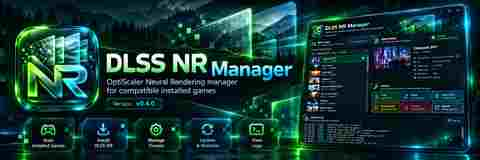

<p align="center">
  
</p>

# DLSS NR Manager

<p align="center">
  
</p>

A native Windows manager for installing, diagnosing and maintaining the experimental **OptiScaler DLSS Neural Rendering (DLSSNR)** fork.

Current application version: **v0.5.1**.

> Supports automatic candidate detection across **Steam, Epic, GOG, Ubisoft Connect, EA App, Xbox App and Battle.net**, with upstream-validated profiles for Cyberpunk 2077, Baldur's Gate 3 and Hogwarts Legacy, plus NVIDIA RTX 20/30/40/50 GPUs.

## Interface preview

<p align="center">
  
</p>

The branding assets live under `assets/branding/`. The interface image is a design target for the ongoing WPF UI refresh; runtime compatibility and installation status remain determined by the application itself.

## Features

- WPF / .NET 8, Windows x64
- Self-contained single-file executable
- Installed-game scanning through Steam, Epic, GOG, Ubisoft Connect, EA App, Xbox App and Battle.net sources
- Bounded scanner concurrency (4 workers) and a short-lived local scan cache to keep startup responsive
- Compatibility confidence: Validated / Probable / Candidate
- Upstream-validated target paths for Cyberpunk 2077, Baldur's Gate 3 and Hogwarts Legacy
- Heuristic detection using DLSS / Streamline / XeSS / FidelityFX runtime signals
- Manual game-folder selection fallback
- NVIDIA GPU and RTX-generation detection
- Stable/prerelease selection from the upstream OptiScaler-DLSSNR fork
- Downloads the complete upstream release archive
- Never downloads or redistributes the proprietary `nvngx_dlssnr.dll` runtime
- Requires the user to select their own runtime and validates SHA-256, PE x64 architecture, file version and Authenticode trust
- Verifies the downloaded upstream OptiScaler ZIP against the SHA-256 digest published by GitHub Releases when available
- RTX 50 expected SHA-256: `E16BCF15E16E13F527491CDF7845B2FE6521A738D8F7C9C721866A8496E1FC8E`
- RTX 20/30/40 compatibility-runtime SHA-256: `E67DEE209320CDAFE0E93E45675D7AA34323A53ACC57A72B2E40A181581C989A`
- Full managed-install backup before changes, including destination collisions from the extracted OptiScaler package
- Install, update, restore and uninstall
- Detects existing proxy DLLs and refuses to overwrite unknown loaders silently
- Cyberpunk proxy recommendation: `dbghelp.dll`; `dxgi.dll` fallback
- Integrated `OptiScaler.log` viewer with large-log truncation
- Per-game **Diagnose** report: temporal-upscaler signals, proxy, runtime state, OptiScaler load evidence, DLSSNR running evidence and loader conflicts
- Tracks the installed release, proxy, game executable hash, runtime hash and install date in a local manager manifest
- Detects when the game executable changed after DLSS NR was installed
- Neural Rendering preset only edits keys that already exist in the current upstream INI
- OptiScaler overlay is forced on with F10 (`ShortcutKey=0x79`)
- Configurable FPS overlay detail and position
- Optional `TargetProcessName` filtering and OptiScaler-managed ReShade loading
- Checks GitHub Releases for newer DLSS NR Manager versions

## Default Neural Rendering preset

For the current upstream INI the manager sets the following conservative Neural Rendering defaults under `[DlssNr]`:

```ini
Enabled=true
RunBeforeSR=true
Passes=1
WorkingScale=1.0
Style=1
```

The upstream configuration documents `Style=1` as **Natural**. The manager does not create unsupported keys; it only updates keys present in the extracted `OptiScaler.ini`.

## Installation

1. Download the Windows x64 artifact/release.
2. Close the target game and its launcher.
3. Run `DlssNrManager.exe`.
4. Select a detected game or choose the executable folder manually.
5. Select your separately obtained `nvngx_dlssnr.dll`.
6. Confirm the runtime validation for the detected RTX generation.
7. Review the recommended proxy and run **Diagnose game** if the title is not upstream-validated.
8. Click **Install**.

The manager installs into the selected game's executable folder. Cyberpunk 2077 uses the upstream-validated `bin\x64` target and `dbghelp.dll` recommendation.

## Loader compatibility

Cyberpunk installations using **Cyber Engine Tweaks (CET), RED4ext, ReShade or other DLL loaders** can already own common proxy names. DLSS NR Manager will not silently overwrite a proxy DLL it cannot identify as OptiScaler.

Upstream specifically validates `dbghelp.dll` for Cyberpunk. `dxgi.dll` is the recommended fallback. Avoid `d3d12.dll` when Cyberpunk Ray Reconstruction becomes unavailable/greyed out because upstream documents a Streamline conflict resolved by switching to `dxgi.dll`.

The manager detects common loader conflicts and can ask OptiScaler to load `ReShade64.dll`, but it still avoids silently rewriting arbitrary third-party loader chains.

## Runtime licensing

`nvngx_dlssnr.dll` is not distributed by this project. You must supply it yourself. DLSS NR Manager only verifies the selected file and copies it locally into the game directory.

## Upstream

This project automates installation of:
- `wilsjo2/OptiScaler-DLSSNR-PreSR-Multipass`

OptiScaler and NVIDIA components retain their respective licenses and ownership. DLSS NR Manager itself is MIT licensed.

## Limitations

- Automatic compatibility remains evidence-based. `Validated` means the target path is explicitly documented upstream; `Probable` and `Candidate` still require in-game verification.
- Ubisoft, EA, Xbox and Battle.net discovery is best-effort because launcher metadata formats and permissions can change.
- GPU detection relies on Windows display-adapter registry data.
- The manager does not download or redistribute the proprietary DLSSNR runtime.
- Authenticode is an additional trust signal; the known compatibility runtime for older RTX generations may not have the same signature properties as NVIDIA's RTX 50 runtime.
- The manager does not silently chain arbitrary third-party proxy loaders.
- The manager should not be used to inject mods into anti-cheat protected multiplayer games.

## Build

```powershell
dotnet restore
dotnet publish DlssNrManager.csproj -c Release -r win-x64 --self-contained true -p:PublishSingleFile=true
```

GitHub Actions publishes `DlssNrManager.exe` as a build artifact. Tags matching `v*` also create a GitHub Release with the executable and ZIP.
